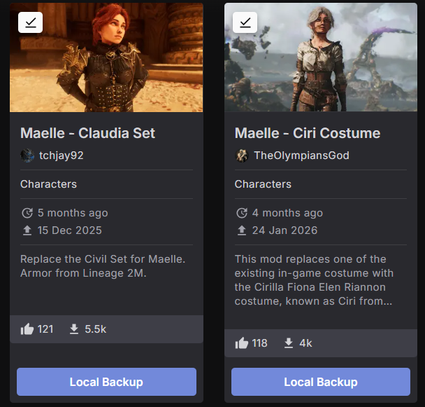
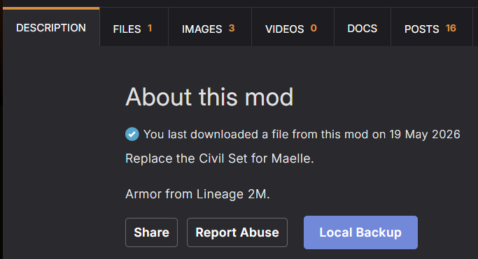
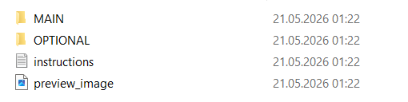

# Nexus Mods Local Backup

A Tampermonkey userscript that adds a handy **"Local Backup"** button to Nexus Mods pages. Instead of manually downloading files one by one, this script automatically fetches the mod's description, preview image, and all main and optional files, saving them into a neatly organized subfolder right in your Downloads directory. The **"Local Backup"** button will be added to mod pages, mod cards, mod author profiles, download history and search results.

  
  

## ⚙️ Prerequisites: Install Tampermonkey

To use this script, you need the Tampermonkey extension installed in your browser.

1. Download Tampermonkey for your browser: [Tampermonkey.net](https://www.tampermonkey.net/)
2. Install the extension and make sure it is enabled.

## 🛠️ Configuration

By default, browser extensions aren't allowed to create subfolders in your Downloads directory. You **must** configure Tampermonkey to allow this. If you don't configure this, the script will still work, but it will download all files directly to your Downloads folder without creating subfolders.

1. Open your **Tampermonkey Dashboard** (Click the Tampermonkey icon in your browser extension bar and select "Dashboard").
2. Click on the **Settings** tab.
3. At the very top of the page, change **Config mode** to **Advanced**.
4. Scroll down until you find the **Downloads** section.
5. Change **Download Mode** to **Browser API**.
6. Add **7z** to allowed file-endings: /\.(zip|tgz|tar|bin|**7z**)$/
7. *Note: Your browser may pop up a notification asking for permission to allow Tampermonkey to manage your downloads. You must click "Allow" or "Yes".*

## 📥 Installation

1. Click this link to view the script: **[NexusModsLocalBackup.user.js](https://github.com/Raccoon1511/NexusModsLocalBackup/raw/refs/heads/main/NexusModsLocalBackup.user.js)**
2. Click on install

## 🔑 Getting Your Nexus Mods API Key

The script needs an API key to communicate with Nexus Mods and fetch the files automatically.

1. Log into your account on [Nexus Mods](https://www.nexusmods.com/).
2. Go to your **API Access** page. (You can find this by clicking your profile avatar > Site Preferences > API / Integrations, or by going directly to [next.nexusmods.com/settings/api-keys](https://www.nexusmods.com/settings/api-keys)).
3. Scroll down to **Personal API Key**.
4. Click **Generate** (or copy your existing key).

## 🚀 How to Use

1. Go to any mod page on Nexus Mods.
2. You will now see a purple **Local Backup** button next to the standard mod actions (Endorse, Track, etc.).
3. Click it.
4. **On your first use**, a prompt will appear asking for your Nexus Mods API Key. Paste the key you generated in the previous step. *(Tampermonkey will securely save this key, so you only have to do this once).*
5. The script will read the mod info and download the instructions, preview image, and files directly into a new folder named after the mod in your Downloads directory.

 

## 🌐 Browser Compatibility

Tested on **Edge**, **Firefox**, and **Chrome**.

For **Chrome**, an additional steps is required:
1. Go to `chrome://extensions`
2. Click on **Details** for Tampermonkey and **Allow userscripts**
